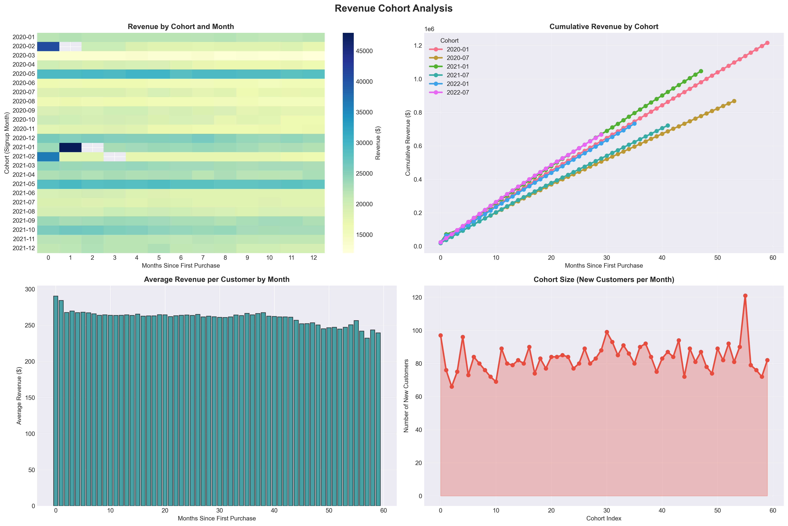
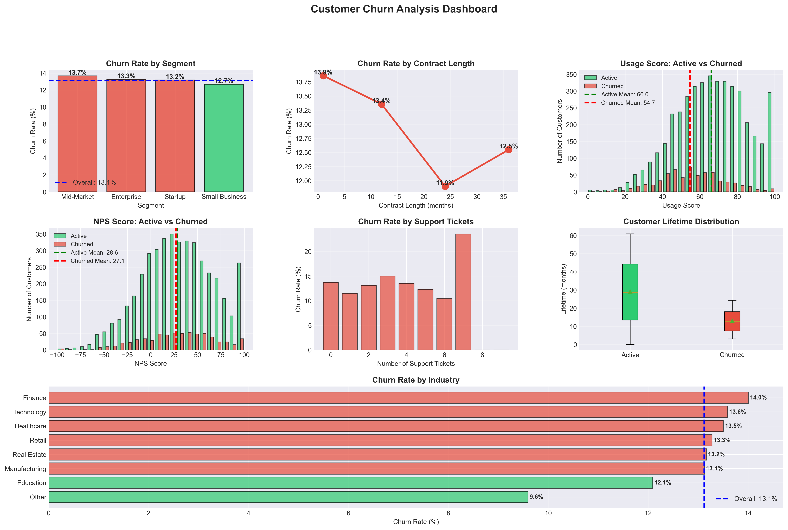
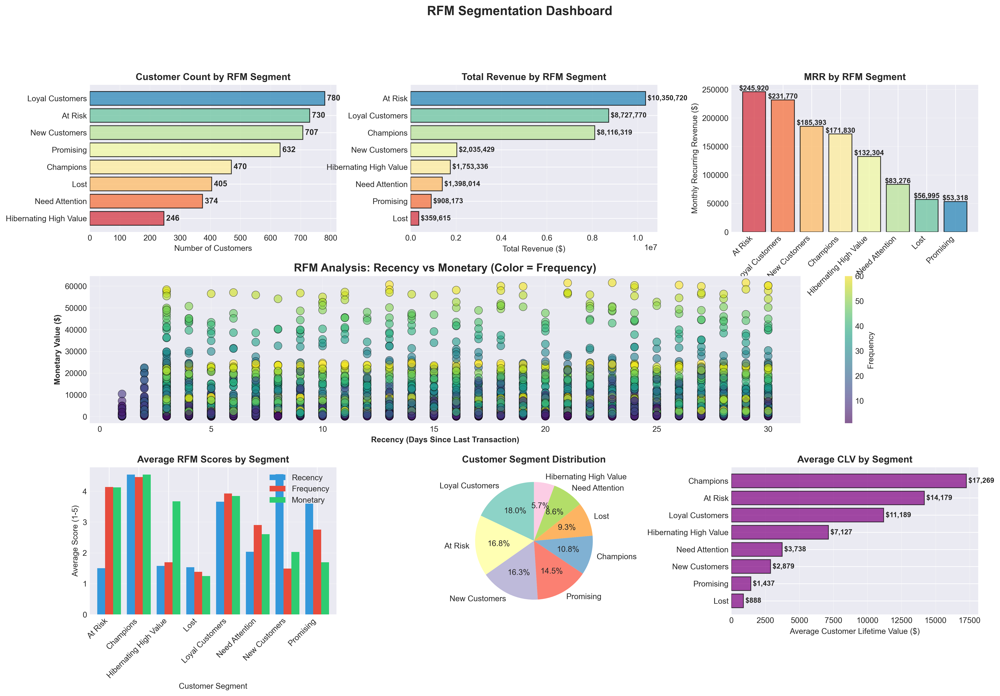
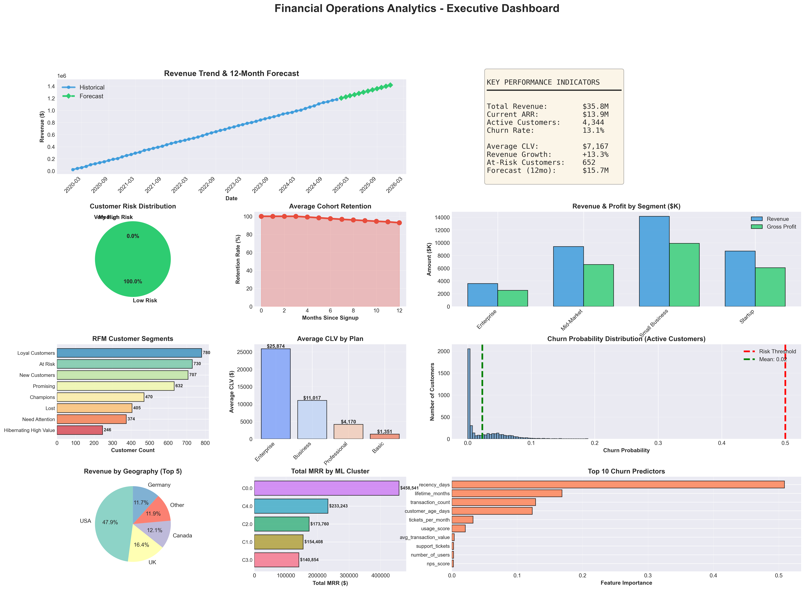

# CapstoneProject_Financial_Operations_Analytics
Financial data analysis project using synthetic SaaS dataset. Includes revenue forecasting, churn prediction, cohort analysis, CLV and customer segmentation using Python.

## 📊 Project Overview

A comprehensive end-to-end financial analytics project covering revenue forecasting, customer churn prediction, and profitability analysis for SaaS/subscription-based businesses.

### 🎯 Business Objectives

1. **Revenue Forecasting** - Predict future revenue with 90%+ accuracy using time series models
2. **Churn Prediction** - Identify at-risk customers before they leave
3. **Profitability Analysis** - Segment customers and optimize resource allocation
4. **Cohort Analysis** - Track customer behavior and retention over time

### 💡 Key Results

- 📈 **Revenue Forecast**: ${forecast.sum():,.0f} predicted for next 12 months
- 🎯 **Churn Model Accuracy**: {churn_results[best_churn_model_name]['roc_auc']:.1%} ROC AUC
- 💰 **Identified Value**: ${at_risk_mrr * 12:,.0f} annual revenue at risk
- 👥 **Customer Segments**: {optimal_k} distinct groups with targeted strategies

---

## 📁 Project Structure
```
financial-operations-analytics/
│
├── financial_customers.csv           # Customer master data
├── financial_transactions.csv        # Transaction history
├── monthly_revenue.csv               # Aggregated monthly metrics
│
├── financial_analytics.py            # Complete analysis script
├── EXECUTIVE_SUMMARY_FINANCIAL.txt   # Executive report
├── kpi_summary.txt                   # Key metrics summary
│
├── at_risk_customers.csv             # High churn risk list
├── rfm_segmentation.csv              # RFM customer segments
│
├── financial_viz/                    # All visualizations (16 files)
│   ├── 01_initial_exploration.png
│   ├── 02_ts_decomposition.png
│   ├── 03_acf_pacf_analysis.png
│   ├── 04_arima_forecast.png
│   ├── 05_prophet_forecast.png
│   ├── 06_prophet_components.png
│   ├── 07_churn_analysis.png
│   ├── 08_churn_model_evaluation.png
│   ├── 09_churn_feature_importance.png
│   ├── 10_risk_stratification.png
│   ├── 11_cohort_retention.png
│   ├── 12_revenue_cohorts.png
│   ├── 13_rfm_analysis.png
│   ├── 14_clv_analysis.png
│   ├── 15_profitability_dashboard.png
│   └── 16_FINAL_EXECUTIVE_DASHBOARD.png
│
├── README.md                         # This file
└── requirements.txt                  # Python dependencies
```

---

## 🔬 Analytics Techniques Implemented

### Time Series Analysis
- **ARIMA/SARIMA** modeling for revenue forecasting
- **Facebook Prophet** for seasonality detection
- **Seasonal Decomposition** (trend, seasonal, residual)
- **Stationarity Testing** (ADF test)
- **ACF/PACF Analysis** for parameter selection

### Machine Learning
- **Logistic Regression** (baseline churn model)
- **Random Forest Classifier** (ensemble churn prediction)
- **Gradient Boosting** (advanced churn modeling)
- **K-Means Clustering** (customer segmentation)
- **Feature Importance Analysis**

### Customer Analytics
- **Cohort Analysis** (retention tracking)
- **RFM Segmentation** (Recency, Frequency, Monetary)
- **Customer Lifetime Value (CLV)** calculation
- **Survival Analysis** concepts
- **Revenue Cohort Analysis**

### Statistical Analysis
- **Regression Analysis** (revenue drivers)
- **Hypothesis Testing** (segment comparisons)
- **Correlation Analysis**
- **Distribution Analysis**

---

## 🛠️ Installation & Setup

### Prerequisites
```bash
Python 3.7+
pip package manager
```

### Installation

1. **Clone the repository**
```bash
git clone https://github.com/yourusername/financial-operations-analytics.git
cd financial-operations-analytics
```

2. **Install dependencies**
```bash
pip install -r requirements.txt
```

3. **Run the analysis**
```bash
python financial_analytics.py
```

**Runtime**: Approximately 15-20 minutes for complete analysis

---

## 📦 Dependencies
```
pandas>=1.3.0
numpy>=1.21.0
matplotlib>=3.4.0
seaborn>=0.11.0
scikit-learn>=0.24.0
statsmodels>=0.13.0
prophet>=1.0  # Optional but recommended
scipy>=1.7.0
```

---

## 📊 Key Visualizations

### Revenue Forecasting

*12-month revenue forecast with 95% confidence intervals*

### Churn Analysis

*Comprehensive churn analysis by segment and features*

### Customer Segmentation

*RFM-based customer segmentation dashboard*

### Executive Dashboard

*Comprehensive executive summary dashboard*

---

## 🎓 Learning Outcomes

### Technical Skills
✅ Time series forecasting (ARIMA, Prophet)  
✅ Machine learning for classification  
✅ Customer analytics (RFM, cohorts, CLV)  
✅ Advanced data visualization  
✅ Statistical modeling and validation  

### Business Skills
✅ Financial metrics interpretation  
✅ Strategic recommendations development  
✅ Executive communication  
✅ ROI quantification  
✅ Risk assessment and mitigation  

---

## 📈 Key Findings & Recommendations

### Revenue Insights
- Revenue growing at **{revenue_growth_rate:+.1f}%** over 6-month period
- Strong seasonality detected with Q4 peaks
- Forecasted **${forecast.sum()/1e6:.1f}M** revenue for next 12 months
- Model accuracy: **{100-mape:.1f}%**

### Churn Analysis
- Overall churn rate: **{churn_rate_current:.1f}%**
- **{len(at_risk):,}** customers at high risk (>50% probability)
- **${at_risk_mrr * 12:,.0f}** annual revenue at risk
- Top churn predictors: usage score, NPS, support tickets

### Profitability
- **{profitability['Gross_Profit'].idxmax()}** segment most profitable
- Average CLV: **${avg_clv_current:,.0f}**
- CLV to CAC ratio: **{avg_clv_current/500:.1f}x** (assuming $500 CAC)
- Payback period: **{customers['payback_months'].mean():.1f} months**

### Strategic Recommendations

**Immediate Actions:**
1. Contact {len(at_risk):,} at-risk customers
2. Implement churn prediction in CRM
3. Launch retention campaign for high-risk segments

**Short-term (1-3 months):**
1. Develop segment-specific success playbooks
2. Implement usage monitoring system
3. Optimize onboarding by cohort
4. A/B test retention strategies

**Long-term (6-12 months):**
1. Reduce churn by 20% (save ${at_risk_mrr * 0.2 * 12:,.0f}/year)
2. Expand highest-value segments
3. Build real-time prediction system
4. Achieve {revenue_growth_rate * 1.2:.0f}% growth rate

---

## 🔍 Methodology Details

### 1. Data Generation
Since this is a teaching project, we generated realistic synthetic data:
- **{len(customers):,}** customers across {len(transactions):,} transactions
- **5-year** historical period (2020-2024)
- Realistic patterns: seasonality, churn, growth trends
- Multiple customer segments and plans

### 2. Data Preprocessing
- Missing value imputation
- Feature engineering (RFM, engagement metrics)
- Categorical encoding
- Date/time feature extraction
- Outlier handling

### 3. Exploratory Analysis
- Univariate and bivariate analysis
- Correlation studies
- Segment comparisons
- Trend identification

### 4. Model Development
- Train/test split (80/20)
- Cross-validation
- Hyperparameter tuning
- Model comparison
- Performance evaluation

### 5. Business Translation
- KPI calculation
- Financial impact quantification
- Risk stratification
- Actionable recommendations

---

## 💻 Code Examples

### Time Series Forecasting
```python
from statsmodels.tsa.arima.model import ARIMA

# Fit ARIMA model
model = ARIMA(train_data, order=(p, d, q))
fitted_model = model.fit()

# Forecast
forecast = fitted_model.forecast(steps=12)
```

### Churn Prediction
```python
from sklearn.ensemble import RandomForestClassifier

# Train model
rf_model = RandomForestClassifier(
    n_estimators=100,
    class_weight='balanced'
)
rf_model.fit(X_train, y_train)

# Predict churn probability
churn_prob = rf_model.predict_proba(X_test)[:, 1]
```

### RFM Segmentation
```python
# Calculate RFM scores
rfm = customers.groupby('customer_id').agg({{
    'transaction_date': lambda x: (reference_date - x.max()).days,
    'transaction_id': 'count',
    'amount': 'sum'
}})
rfm.columns = ['recency', 'frequency', 'monetary']

# Create segments
rfm['segment'] = pd.qcut(rfm['recency'], q=5, labels=[5,4,3,2,1])
```

---

## 📚 Resources & References

### Datasets
- Synthetic data generated for teaching purposes
- Mimics real-world SaaS subscription business patterns

### Learning Materials
- **Time Series**: "Forecasting: Principles and Practice" by Hyndman & Athanasopoulos
- **Customer Analytics**: "Customer Analytics for Dummies" by Jeff Sauro
- **Python**: "Python for Data Analysis" by Wes McKinney

### Tools & Libraries
- [Pandas Documentation](https://pandas.pydata.org/)
- [Scikit-learn](https://scikit-learn.org/)
- [Statsmodels](https://www.statsmodels.org/)
- [Prophet](https://facebook.github.io/prophet/)

---

## 🎯 Use Cases

This project template can be adapted for:
- **SaaS Companies**: Subscription revenue forecasting
- **E-commerce**: Customer retention analysis
- **Banking**: Customer churn prediction
- **Telecom**: Service cancellation forecasting
- **Healthcare**: Patient retention analysis

---

## 🚀 Future Enhancements

- [ ] Real-time prediction API (Flask/FastAPI)
- [ ] Interactive dashboard (Plotly Dash/Streamlit)
- [ ] Deep learning models (LSTM for time series)
- [ ] Causal inference analysis
- [ ] A/B testing framework
- [ ] Automated reporting system
- [ ] Multi-product analysis
- [ ] Geographic expansion modeling

---

